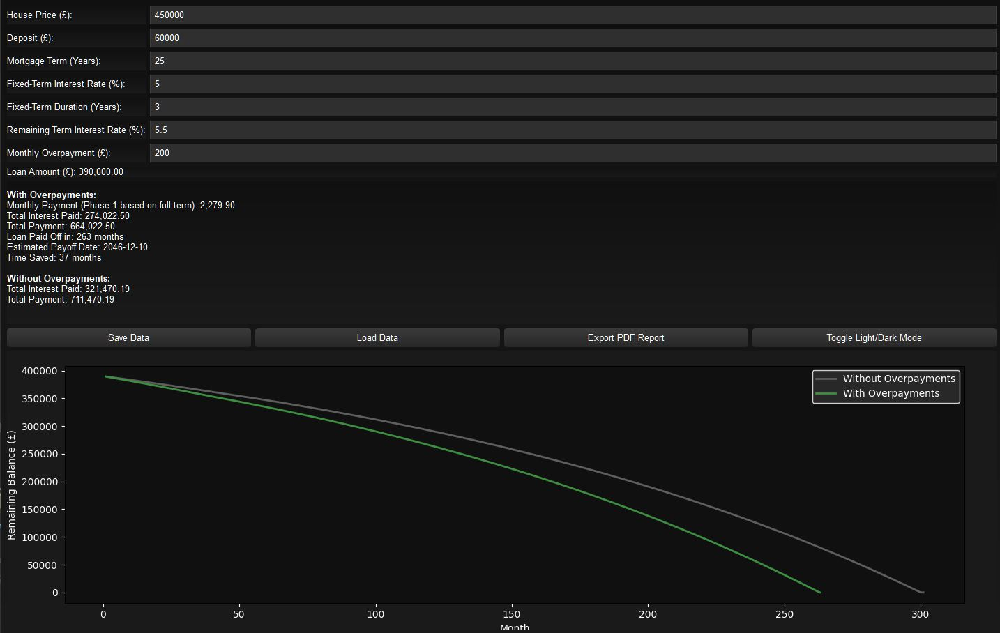

# Mortgage Overpayment Tracker

| Developer & Author | Built                |
|--------------------|----------------------|
| Naadir D           | 2025                 |

# Mortgage Overpayment Tracker

| Developer & Author | Built          |
|--------------------|----------------|
| Naadir D           | 2025           |

## Overview

**Mortgage Overpayment Tracker** is a PyQt6 application that helps you track and simulate mortgage amortization with customizable overpayments, visualize balance over time, and export comprehensive PDF reports. It supports saving and loading your mortgage details and features a toggleable dark/light theme.

## Features

- Input house price, deposit, term, fixed and remaining interest rates, and monthly overpayments
- Simulate amortization schedules with and without overpayments
- Dynamic matplotlib graph of remaining balance over time
- Export detailed PDF reports with summary, breakdown, and embedded graph
- Save/load mortgage details to/from local JSON files
- Toggle between dark and light themes for improved usability
Enter your mortgage details, adjust monthly overpayments, and view the payoff simulation. Use the buttons to save/load data or export a PDF report.

## Requirements

- Python 3.8 or higher
- PyQt6
- matplotlib
- reportlab
