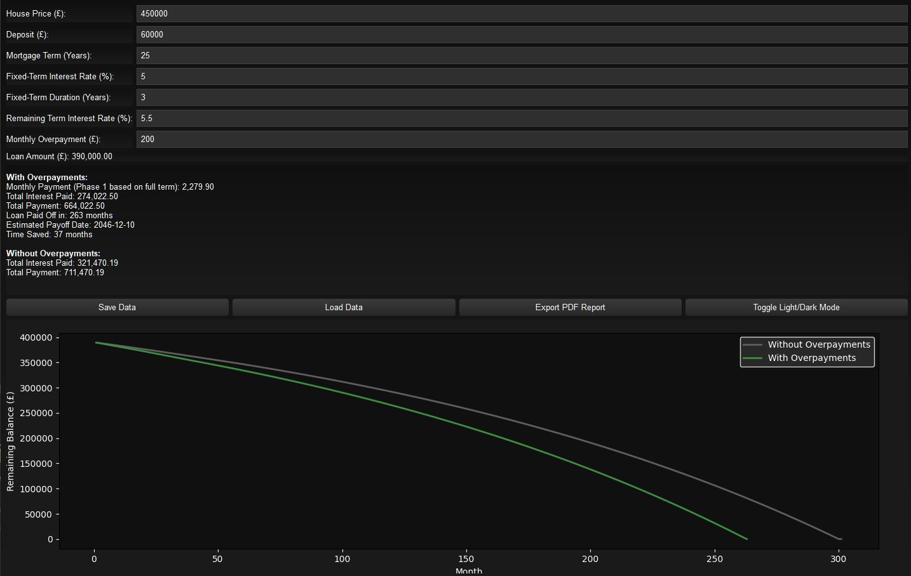

# Mortgage Overpayment Tracker

> PyQt6 desktop application for calculating mortgage amortisation schedules with overpayment simulation and PDF reporting.

[](https://www.python.org/)
[](https://www.riverbankcomputing.com/software/pyqt/)
[](https://www.reportlab.com/)

---

## Overview

The Mortgage Overpayment Tracker is a professional desktop application built with PyQt6 that helps homeowners understand the impact of monthly overpayments on their mortgage. This application allows users to input detailed mortgage parameters, simulate amortization schedules with and without overpayments, visualize the results with dynamic graphs, and export comprehensive PDF reports.

The calculator supports two-phase interest rates (fixed followed by variable), automatically computes payoff dates, calculates time savings, and provides detailed payment breakdowns. All mortgage data can be saved and loaded locally as JSON files, and users can toggle between dark and light themes for comfortable viewing in any environment.

Perfect for financial planning, this tool helps users visualize exactly how additional payments can accelerate mortgage payoff and reduce total interest paid over the life of the loan.

---

## Features

- Input mortgage details with support for two-phase interest rates (fixed + variable)
- Simulate amortization schedules with and without monthly overpayments
- Real-time calculation updates with debounced input handling
- Visual comparison graphs showing mortgage balance over time
- Detailed payment breakdown including total interest, principal, and overpayment amounts
- Estimated payoff date and time savings calculations
- Save and load mortgage data as JSON files for future reference
- Export comprehensive PDF reports with mortgage summary and graphs
- Toggle between dark and light themes
- Professional UI with input validation

---

## Screenshots

> Drop screenshots into `screens/` and reference them below.



---

## Getting Started

### Prerequisites

- Python 3.8 or higher
- PyQt6
- Matplotlib
- ReportLab

### Installation

```bash
git clone https://github.com/Naadir-Dev-Portfolio/Desktop-Mortgage-overpayment-tracker.git
cd Desktop-Mortgage-overpayment-tracker
pip install -r requirements.txt
```

### Run

```bash
python main.py
```

---

## Tech Stack

- PyQt6 — Modern desktop UI framework
- Matplotlib — Interactive mortgage balance graphs
- ReportLab — PDF report generation
- Python — Core application logic

---

## Related Projects

- [Desktop-PyQt6-finance-dashboard](https://github.com/Naadir-Dev-Portfolio/Desktop-PyQt6-finance-dashboard)
- [Desktop-PyQt6-health-dashboard](https://github.com/Naadir-Dev-Portfolio/Desktop-PyQt6-health-dashboard)
- [Desktop-youtube-view-stats-dashboard](https://github.com/Naadir-Dev-Portfolio/Desktop-youtube-view-stats-dashboard)
