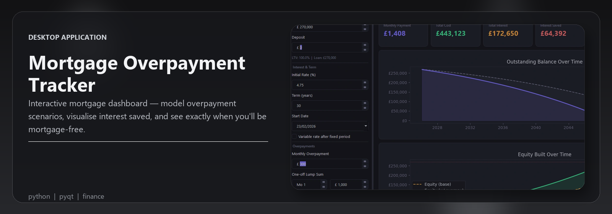
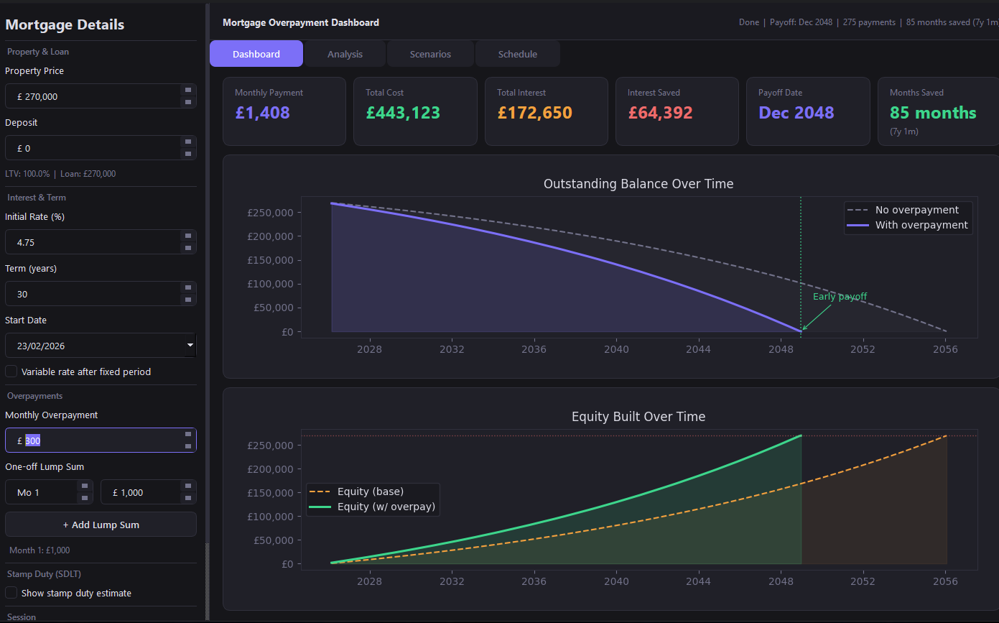
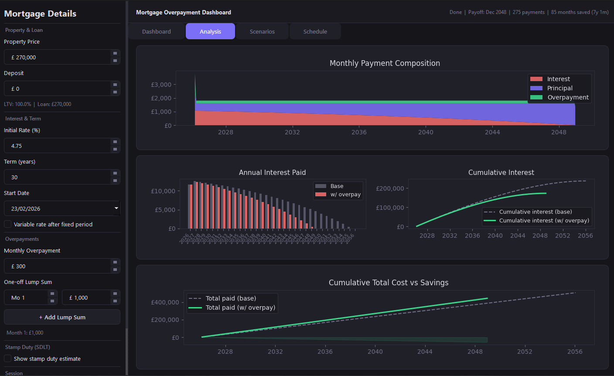
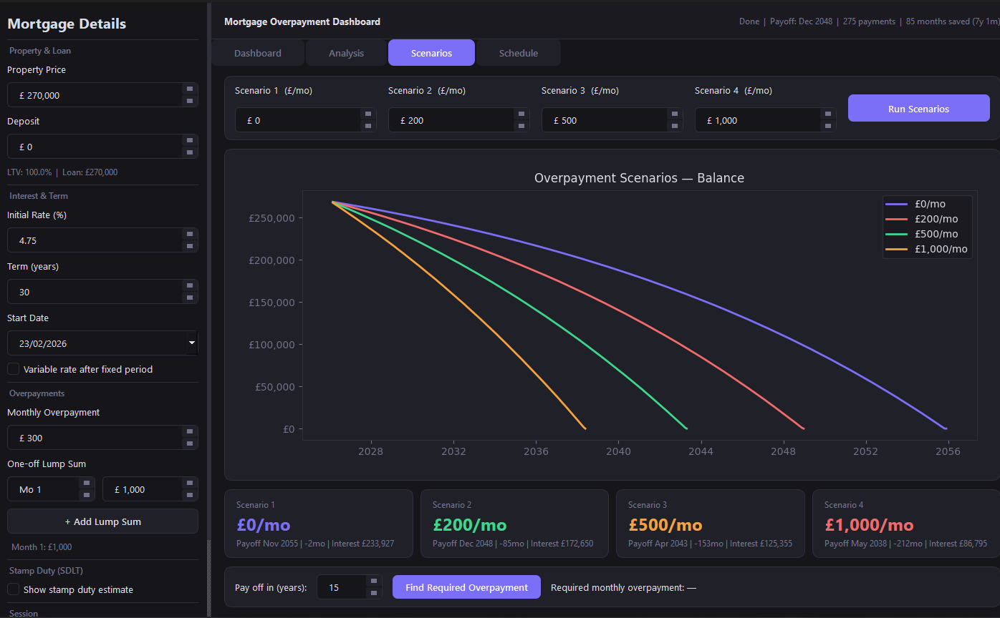
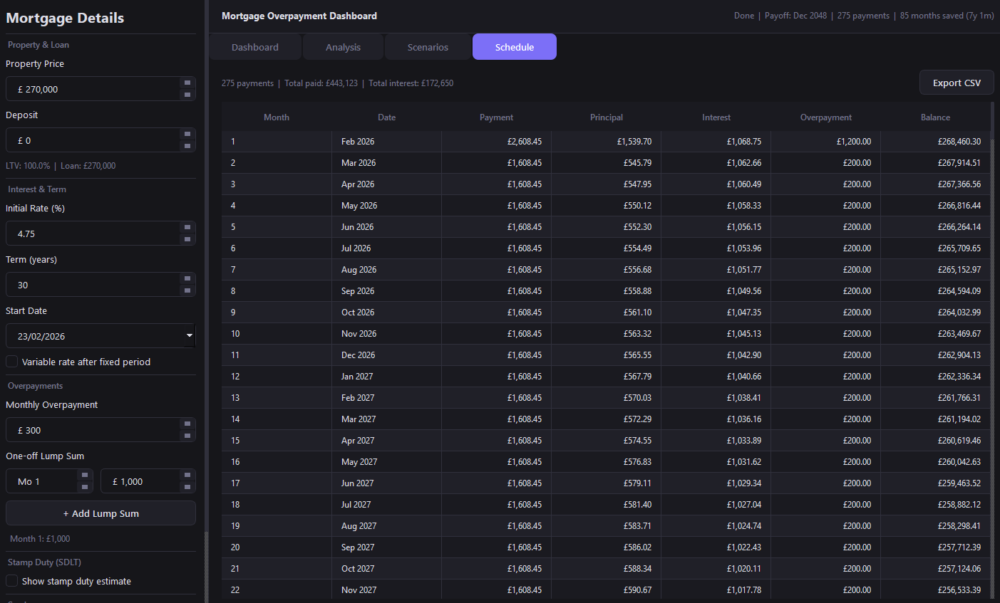

<div align="center">


<br /><br />

<p><strong>Interactive mortgage dashboard, model overpayment scenarios, visualise interest saved, and see exactly when you'll be mortgage free.</strong></p>

<p>Built for homeowners who want to take control of their mortgage rather than just accept the default repayment schedule.</p>

<p>
  <a href="#overview">Overview</a> |
  <a href="#what-problem-it-solves">What It Solves</a> |
  <a href="#feature-highlights">Features</a> |
  <a href="#screenshots">Screenshots</a> |
  <a href="#quick-start">Quick Start</a> |
  <a href="#tech-stack">Tech Stack</a>
</p>

<h3><strong>Made by Naadir | January 2025</strong></h3>

</div>

---

## Overview

Most mortgage calculators tell you your monthly payment and not much else. This dashboard goes further, it shows you the full amortisation picture, lets you model what happens if you overpay by any amount each month or make a one off lump sum payment, and tells you exactly how many months you'd shave off the term and how much interest you'd save.

It supports two-phase rate scenarios (e.g. a 2-year fixed at 4.6% rolling onto a 7.49% variable), lump sum overpayments at specific months, UK Stamp Duty calculation, and a binary search target payoff calculator that works backwards from a desired payoff date to the overpayment amount required to hit it.

## What Problem It Solves

- Most people have no idea how much a small regular overpayment actually saves, this makes it tangible and visual
- Switching from a fixed to a variable-rate mid term is hard to model manually, the two-phase simulator handles it automatically
- Understanding whether to make a lump sum payment vs spreading it monthly, the scenarios tab lets you compare both side-by-side
- Tracking cumulative interest paid vs equity built over time, both are charted clearly on the dashboard

### At a glance

| Track | Analyse | Compare |
|---|---|---|
| Outstanding balance, equity, monthly payment | Payment composition (interest vs principal vs overpayment) | Up to 4 overpayment scenarios simultaneously |
| Payoff date and months saved | Annual interest paid year-by-year | Base case vs overpaid case across every chart |
| Total cost and interest saved vs base case | Cumulative interest savings over the loan term | Target payoff year vs required monthly overpayment |

## Feature Highlights

- **Dashboard**, 6 live KPI cards plus balance and equity charts update instantly on calculate
- **Two-phase interest rates**, model a fixed-rate period rolling onto a variable-rate, with automatic payment recalculation at the switch point
- **Lump sum support**, schedule one off overpayments at any month in the term
- **Scenarios tab**, run 4 custom overpayment amounts side-by-side with a balance comparison chart and per scenario summary cards
- **Target payoff calculator**, enter a desired payoff year and the app binary searches for the exact monthly overpayment needed
- **UK Stamp Duty calculator**, 2025 SDLT rates with first-time buyer and additional property flags
- **Full amortisation schedule**, every payment month-by-month with CSV export
- **Session save / load**, save your mortgage details to JSON and reload them later

### Core capabilities

| Area | What it gives you |
|---|---|
| **Calculation engine** | Fixed-payment amortisation simulation with accurate overpayment modelling, overpayments reduce term, not just balance |
| **Dashboard tab** | Balance over time, equity growth, payoff date, months saved, interest saved vs baseline |
| **Analysis tab** | Payment composition stackplot, annual interest bar comparison, cumulative cost vs savings chart |
| **Scenarios tab** | Four way overpayment scenario comparison, target payoff binary search |
| **Schedule tab** | Complete month-by-month amortisation table with CSV export |

## Screenshots

<details>
<summary><strong>Open screenshot gallery</strong></summary>

<br />

<div align="center">
  
  <br /><br />
  
  <br /><br />
  
  <br /><br />
  
</div>

</details>

## Quick Start

```bash
# Clone the repo
git clone https://github.com/Naadir-Dev-Portfolio/Mortgage-Overpayment-Tracker.git
cd Mortgage-Overpayment-Tracker

# Install dependencies
pip install -r requirements.txt

# Run
python main.py
```

On first launch the app pre-fills with the values from `initial.json`. Edit that file to set your own mortgage details as defaults, or use the sidebar inputs and hit **Save** to create your own session file.

No API keys or environment variables required, everything runs locally.

## Tech Stack

<details>
<summary><strong>Open tech stack</strong></summary>

<br />

| Category | Tools |
|---|---|
| **Language** | Python 3.10+ |
| **UI Framework** | PyQt6 6.4+ |
| **Charts** | matplotlib 3.5+, embedded via `FigureCanvasQTAgg` |
| **Numerics** | NumPy 1.24+ |
| **Date handling** | python-dateutil 2.8+ (accurate monthly date stepping) |
| **Data / Storage** | JSON (session save/load, no database) |
| **Export** | CSV (amortisation schedule) |
| **Platform** | Windows / macOS / Linux (Windows dark title bar via DWM API) |

</details>

## Architecture & Data

<details>
<summary><strong>Open architecture and data details</strong></summary>

<br />

### Calculation model

The app uses a **fixed-payment amortisation** model, the monthly base payment is calculated once at the start and held constant throughout the term (matching how UK mortgages actually work). Overpayments are applied on top of the fixed-payment each month, directly reducing the outstanding principal and shortening the term.

For two-phase rates, the payment is recalculated at the rate switch point based on the remaining balance and remaining term at that moment.

### Project structure

```text
Mortgage-Overpayment-Tracker/
├── main.py               # All application code
├── initial.json          # Default mortgage values loaded on startup
├── requirements.txt
├── README.md
├── repo-card.png
├── screens/
│   └── screen.JPG
└── portfolio/
    ├── mortgage-overpayment-tracker.json
    └── mortgageTrackerScreen.webp
```

### Data / system notes

- All calculations are in-memory, no database or external services
- Sessions are saved as plain JSON files the user can share or version control
- The amortisation schedule CSV export matches the on screen table exactly

</details>

## Contact

Questions, feedback, or collaboration: `naadir.dev.mail@gmail.com`
